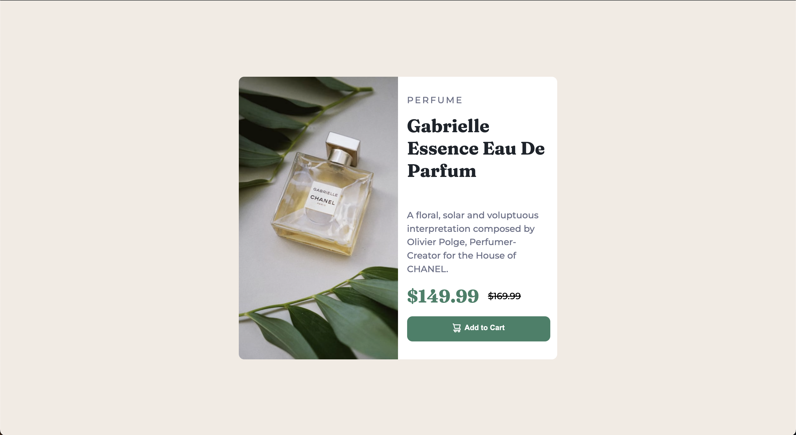

# Frontend Mentor - Product preview card component solution

This is a solution to the [Product preview card component challenge on Frontend Mentor](https://www.frontendmentor.io/challenges/product-preview-card-component-GO7UmttRfa). Frontend Mentor challenges help you improve your coding skills by building realistic projects. 

## Table of contents

- [Overview](#overview)
  - [The challenge](#the-challenge)
  - [Screenshot](#screenshot)
  - [Links](#links)
- [My process](#my-process)
  - [Built with](#built-with)
  - [What I learned](#what-i-learned)
  - [Continued development](#continued-development)
  - [Useful resources](#useful-resources)
- [Author](#author)

**Note: Delete this note and update the table of contents based on what sections you keep.**

## Overview

### The challenge

Users should be able to:

- View the optimal layout depending on their device's screen size
- See hover and focus states for interactive elements

### Screenshot



### Links

- Solution URL: [GitHub](https://github.com/catreedle/product-preview-card)
- Live Site URL: [Live Site](https://product-preview-card-two-indol.vercel.app/)

## My process

### Built with

- Semantic HTML5 markup
- CSS custom properties
- Flexbox
- CSS Grid
- Mobile-first workflow

**Note: These are just examples. Delete this note and replace the list above with your own choices**

### What I learned

I learned to use mobile-first workflow in this project and how to make responsive page on different screen size. I spent too many times figuring out why the font won't load, apparently I need to import the font url at the top line on my css style.

I also learned about logical properties and tried using them in some part here.

```css
@import url("https://fonts.googleapis.com/css2?family=Montserrat:wght@500;700&family=Fraunces:wght@700&display=swap");
```

I try using rem unit sizing instead of pixel, I am not too comfortable with it yet, hope I'm doing it correctly.

After I'm done with mobile, I struggled with transforming the style to fit desktop design, had to change the HTML structure a bit. Even now there are still some errors when I resize the page, sometimes the image becomes too narrow, sometimes the button and the image overflow the body (container). Maybe it's bad practice to use body as elements container? If you can help pointing out how I can fix the error, it would be greatly appreciated.

### Continued development

There are still some errors in the responsiveness of this page.

### Useful resources

- [Responsive design](https://web.dev/learn/design/) - I learned many things here. I just discovered about logical properties, also using different version of images with srcset.

## Author

- Website - [Purnama S Rahayu](https://www.purnamaadev)
- Frontend Mentor - [@catreedle](https://www.frontendmentor.io/profile/catreedle)
